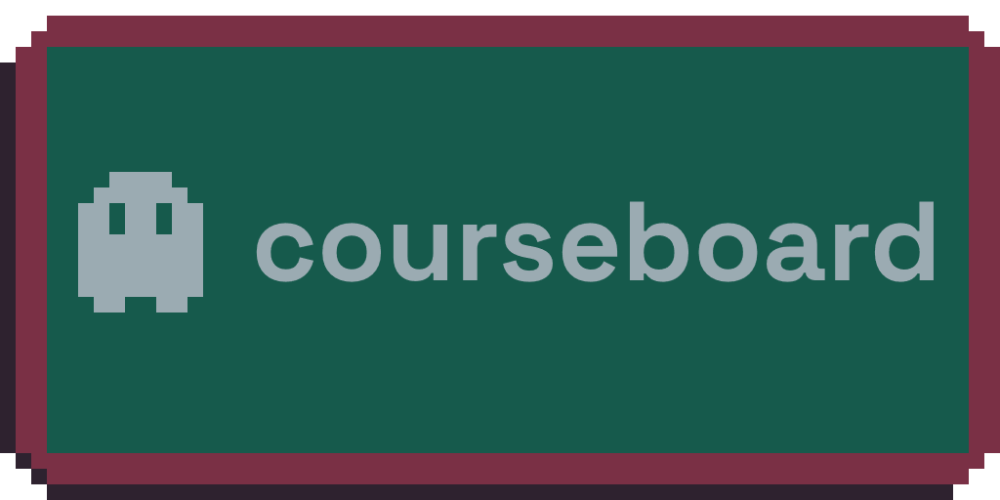

## About
Courseboard is a tool that lets you add links to classes to a centralized dashboard and customize them with a banner, notes, and other info. Check it out at [courseboard.vivime.info](https://courseboard.vivime.info)

## Useful Commands
- `npm install` — Project setup
- `npm run serve` — Compiles project and hot-reloads for development
- `npm run build` — Compile, and minify for production
- `npm run lint` — Lints and fixes files
